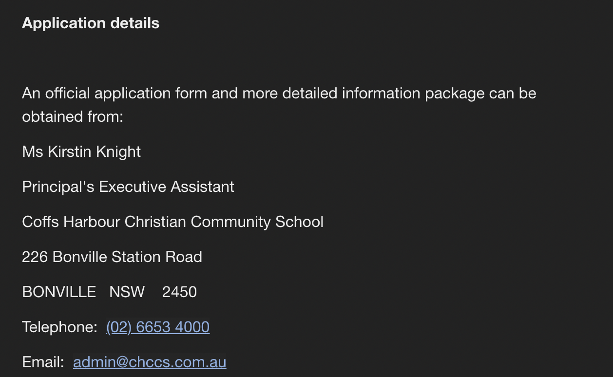

# A1-HANNANBAIG
<!DOCTYPE html>
<html>
<head>

</head>
<body>

<h1 style="font-family:verdana;">PERSONAL INFORMATION</h1>

<h3 style="color:purple;">Name:</h3>

<b>
Hannan Baig

<h3 style="color:purple;">Student Number:</h3>

s3898005

<h3 style="color:purple;">Student Email Address:</h3>

s3898005@student.rmit.edu.au

<h3 style="color:purple;">Nationality:</h3>

I was born and raised in Melbourne, my parents are from Pakistan.

<h3 style="color:purple;">Education:</h3>

Graduated from year 12 from Balwyn High school and I am currently studying bachelor of IT at RMIT.

<h3 style="color:purple;">Languages:</h3>

I speak English and Urdu. 

<h3 style="color:purple;">Intersting Fact:</h3>

My favourite sport is Basketball. I have been playing for a Basketball club called Balwyn Blazers since 2015. I also follow the NBA (National Basketball Association) and support the Oklahoma City Thunder.

</body>

</html>

<!DOCTYPE html>
<html>
<body>

<h3 style="color:purple;">Picture:</h3>

</body>
</html>

<!DOCTYPE html>
<html>
<head>
<title>Page Title</title>
</head>
<body>

<h1 style="font-family:verdana;">INTERESTS IN IT</h1>
<h2 style="font-size:15px">-What is your interest in IT?</h2> 

My interest in Information technology started relatively later than most people. My first experience with anything related to IT was undertaking the subject Computing in year 10. Unfortunately, I would not develop an interest until year 12. My interests for Information technology grew when I had my school laptop fixed by the IT department in my school, thus helping me realise that my interests in Information technology revolves around making the lives of people easier when it comes to technology. I am also interested in learning about computers as IT is a growing part of society.

</body>

</html>

<h2 style="font-size:15px;">-Why did you choose to come to RMIT?</h2>

I chose to come to RMIT as it is a respected university when it comes to Information technology. Also, the environment of RMIT seemed inviting as it is located in the city with a large support network. The clubs offered at RMIT, including the Islamic society which encouraged me to be a part of RMIT as I made new friends. The flexible timetables were also impressive to me and was a factor in choosing the Royal Melbourne Institution of Technology.

</body>

</html>

<h2 style="font-size:15px;">-What do you expect to learn during your studies?</h2>

I expect to learn the reasoning behind why it is a growing industry. Also, I expect to learn coding related to making websites. I want to learn the importance of allowing users to feel comfortable while using their device or created website. 

</body>

</html>

<h1 style="font-family:verdana;">IDEAL JOB</h1>

<h2 style="font-size:15px;">-The Job Advertisement:</h2>

The job is Information technology support technician at the Coffs Harbour Christian Community School.

Job advertisement link:

<a 

href="url">https://www.seek.com.au/job/51713502type=promoted#searchRequestToken=3184b274-8151-4540-abe8-05a1e1f293bd</a> 

 

<h2 style="font-size:15px;">-A description of the position, and particularly what makes this position appealing to you.</h2>

Information technology support technician is the position at the Coffs Harbour Christian Community School with a large network of computers. It is a full-time position and entails you to take control of three onsite campuses. This position is of interest to me as it is located in NSW, moving to another state provides the opportunity to meet new people and will encourage me to stay motivated as I will have move on the Bonville campus. The job also offers around $60,000 per year in NSW which will help me earn a decent living and motivate me even further to reach my full potential to be a competent information technology support technician.

<h2 style="font-size:15px;">-A description of the skills, qualifications and experience required for the position.</h2>

The skills required for the position are to be determined to make sure the school is maintained in an efficient way. Organisation is a good skill to obtain for the job as there are 600 computers to maintain over three campuses. Having good problem-solving abilities will be useful in fixing the network for the students. Lastly another skill is being resilient as taking care of 600 computers requires a lot of patience and correcting mistakes. Qualifications and experience needed for information technology support technician is to have prior experience in technical support as well as a degree in Bachelor of Information Technology.

<h2 style="font-size:15px;">-A description of the skills, qualifications and experience you currently have.</h2>

The skills I currently have for the job are having good team-working skills as I will have to join the IT team with other people and successfully manage a large network of computers. Another skill I have is being creative as I will have to think of solutions that will work under pressure. I am also respectful towards others which is a positive for the position as it will be more efficient working with the students and other staff members to ultimately provide the school with excellent information technology support technician possible. The qualification and experience is on the way to obtaining a degree in Bachelor of Information Technology, I am currently in first year of bachelor of Information technology at RMIT.

<h2 style="font-size:15px;">-A plan describing how you will obtain the skills, qualifications and experience required for the position, building on those you have now.</h2>

My plan to be determined, organised, have good problem-solving skills and resilient is to do volunteer work and apply for internships to experience the environment of being an Information technology support technician. From already having the skills of teamwork, creativity and respectfulness can help me further develop the skills I need to achieve from the internship as I could be potentially mentored by a qualified worker. By gaining the experience, I will have learnt how information technology support technician work and how they develop good problem-solving skills from a mentor and from observing the work environment. 

<h1 style="font-family:verdana;">PERSONAL PROFILE</h1>

<h2 style="font-size:15px;">-The results of an online Myers-Briggs test: </h2>

<a 

href="url">www.16personalities.com</a> 

<h3 style="font-size:15px;">RESULTS:</h3>

  

<h2 style="font-size:15px;">-The results of an online learning style test:  </h2>

<a 

href="url">https://www.how-to-study.com/learning-style-assessment/</a> 

<h3 style="font-size:15px;">RESULTS:</h3>

 

<h2 style="font-size:15px;">-The results of one further online test of your choosing:  </h2>

<a 

href="url">https://www.how-to-study.com/learning-style-assessment/</a> 

<h3 style="font-size:15px;">CREATIVITY TEST RESULTS:</h3>

 

<h2 style="font-size:15px;">-What do the results of these tests mean for you?</h2>

The results for the Myers-Briggs test were that I’m an adventurer, this indicates to me that my personality is someone who is more of an introvert. I am also 60% observant compared to being intuitive. I am 74% prospecting compared to judging. Being introverted suggests that I would benefit from a job with less people to communicate with and rely on to complete important tasks. Being observant and prospecting would allow me to correctly identify someone who is competent enough to work with. The results for the preferred learning style was auditory compared to other techniques such as visual and tactile. For my learning style to be auditory, it would be a fair assumption that learning in general would be best to hear lectures or having concepts explained by a teacher rather than reading information myself. In a work environment, especially job related to information technology where it would be best suited for instructions to be explained by a boss. Lastly, the results for the creativity test ended up producing a score of 54.32 with an average score of 63.01. My strengths include being able to change my perspectives in different scenarios as well as working on anything without any context. This will be suitable for a job situation as I will be flexible with adjusting to co-workers and being motivated to continue working on any task. CRITQUE: the validity of the overall results is debatable as there are many websites that can produce different results for the Myers-Briggs test. However, there are numerous different results with their own detailed description which suggests that the results are reliable. The learning style test is valid to an extend as there are only three options available them being auditory, visual and tactile. Thus, the results range is very limited in comparison to the Myers-Briggs and creativity score. The creativity score can be considered valid compared to the learning style test as there are around eight different attributes to be assessed on and it gives data compared to the other test. The score is valid as there is a mean score to compare it against. Overall judgement would be that the Myers-Briggs test and the creativity test can be valid compared to the learning style test.

<h2 style="font-size:15px;">
-How do you think these results may influence your behaviour in a team?
</h2>

The Myers-Briggs test results of having the personality trait of an adventurer leads to someone who is open to understand people but is an introvert. Being in a team situation would suggest that I would be open to other people’s ideas in the group. However, it also suggests that working with other people may be difficult and could lead to communication issues in a team. The learning style test suggests the best learning strategy is auditory. In a group scenario, it would be best if a team member can tell me the instructions for any tasks and explain it while talking for efficiency. Lastly the creative test results lean towards shifting people’s perspectives on something as well as accepting others and ideas as they are told. This is beneficial in a team setting as it will be easier to communicate with other people in a team and completing tasks with them.

<h2 style="font-size:15px;">
-How should you take this into account when forming a team?
</h2>

All the results can be taken into account when forming a team as it would be suitable to be paired with people who are extroverted and can voice their opinions freely. Specifically, team members who can provide easy instructions and explain concepts of tasks that need to be completed. It is important that other members are extroverted so it’s easier to communicate with each other to avoid issues.

<h1 style="font-family:verdana;">PROJECT IDEA</h1>

<h3 style="color:purple;">Overview:</h3>

<h1 style="font-size:15px;">
IDEA: Online Therapist
</h1>

The project will be an app that acts as a therapist so to speak. The app will be available on both IOS and Android and can be downloaded on any platforms, including phones and laptops. More specifically the user will be able to discuss their problems with using their microphone or they may choose to type instead. After discussing any issues, they have, specifically issues related to mental health problems. People will receive automated advice from the app that will help the user solve or manage their problems that were brought up. They will be free to download from any platforms, however there will be in app purchases such as editing the layout of the app and removing adds to help fund the app. The overall purpose of the application is to raise awareness about mental health issues and helping people manage them.

<h3 style="color:purple;">Motivation:</h3>

The motivation for the app is to allow people to function efficiently in their everyday life. More specifically, people can utilize the application to their advantage. They can facilitate this through discussing any problems they feel comfortable with that is impacting their personal life. According to recent statistics, 1 in 5 employed adults in the US experience mental health issues including depression (Wisner, 2019). Thus, proving people do think having mental health issues is impacting their work life and that the application will be useful. Overall, the app helping individuals with personal issues regarding their mental health will accomplish the ability for them to manage their lives effectively from the application. Also, Depression is affecting almost 350 million people worldwide (Wisner, 2019). Thus, the motivation of the application being created is to help manage and raise awareness for mental health issues as almost ‘350 million people’ are impacted.

<h3 style="color:purple;">Description:</h3>

The application will be available on IOS and Android and will be called Online Therapist. The purpose of the app is to allow people to openly express any issues they have or if they are looking for advice. The user will be able to either speak using their microphones, or type. The user will first pick from a select few options regarding the type of problem they are experiencing. For example, these include mental health related problems, job or education issues, family problems, drug and alcohol abuse. Lastly, there will be a section called ‘other’ for users if their use of the app doesn’t relate to the other options. After either typing or speaking about their problems, the user will get generated advice offered by the app in text form. In addition, they will be offered other helpful resources such as helplines, websites from other companies to offer them direct help with any problems they may have which is the reason they are utilising the application. There will be a section in the application called ‘statistics’, the goal for this section is to raise awareness on important information regarding mental health, for example statistics such as around 1 in 2 Australians aged 16-85 had experienced a mental disorder during their lifetime (Australia’s health, 2020). The statistics will then be followed by numerous links leading towards Government websites with more detailed information the user may want to read through. Other features of the application include people who will use the application to choose between light and dark mode in order to allow the user to choose their own preferred layout of the application. Another feature for the application is to change languages, automated language will be English with around 30 languages. The language change will include the texts in the app, as well as choosing the language the advice is given. People will also be able to access helplines from around 10 countries around the world. Moreover, users will have the opportunity to have notifications from the app regarding new advice and or links. Users will also have the option to receive daily motivational quotes notification set to any time they please. The application will have advertisements, which people can skip after a period of time. They can also fully remove the advertisement pop-ups by paying a small fee, which is a part of the in-app purchases. For privacy and security reasons, users must make an account in order to discuss their problems and obtain advice. They are able to link their google and Facebook accounts, or simply create an account using a preferred email. Lastly, there will always be a monthly survey available for users inquiring about the app features and how to improve on them. The surveys will be utilized when making upcoming patches to fix bugs and issues in regard to the app performance. The app will need to have fast loading screens to allow the user experience to be enjoyable and less irritable.

<h3 style="color:purple;">Tools and Technologies:</h3>

Tools and technologies needed would be a software to start developing the application. This could be UI Bakery; this software allows people to easily build their applications. It is less time consuming than others as there is no coding involved to make the app. However, you need a subscription in order to access full benefits of the software. Other hardware needed will be a computer with internet to access UI Bakery, as well as information regarding the links for articles and statistics. Also researching the different helplines around 10 different countries for users to access. hello

<h3 style="color:purple;">Skills Requried:</h3>

Skills needed to make the application would be determination as it takes time to research and develop the app. Being able to code is not necessary if UI Bakery is being utilized which is more appropriate for mobile apps. You need to be able to afford the software in order to make the application. Another skill needed is creativity when choosing font and colour designs, as well as section placements to catch the user’s attention in utilizing all the aspects of the app. It is possible to hire someone to make the application if you do not have the needed skills to operate the software and computer which will be used to access the software UI Bakery.

<h3 style="color:purple;">Outcome:</h3>

If the project is successful, the outcome would be that people will have an easily accessible application that will help with any issues they are encountering and is negatively impacting their lives. The problem of mental health issues getting in the way of people ability to function effectively will be solved through raising awareness of mental health issues. Also, through the advice and resources given to people. This will have a great impact on society as people finally are able to discuss and resolve any issues they want. It also raises awareness for mental health problems such as depression and allows people to feel more comfortable with acknowledging and resolving their problems through the app.

<h1 style="font-family:verdana;">BIBLIOGRAPHY</h1>

- Australian Institute of Health and Welfare. 2021. Mental health - Australian Institute of Health and Welfare . [ONLINE] Available at: 

<a 

href="url">https://www.aihw.gov.au/reports/australias-health/mental-health.  </a> 

[Accessed 25 March 2021].

- SEEK. 2021. [ONLINE] Available at: 

<a 

href="url">https://www.seek.com.au/job/51713502?type=promoted#searchRequestToken=3184b274-8151-4540-abe8-05a1e1f293bd.   </a> 

[Accessed 23 March 2021].

- Talkspace. 2021. 32 Surprising Mental Health Statistics | Talkspace. [ONLINE] Available at: 

<a 

href="url">https://www.talkspace.com/blog/mental-health-statistics/.   </a>
[Accessed 27 March 2021].

- Top 9 No-Code Bubble Alternatives. 2021. Top 9 No-Code Bubble Alternatives. [ONLINE] Available at: 

<a 

href="url">https://uibakery.io/bubble-alternatives.  </a>
[Accessed 27 March 2021].

